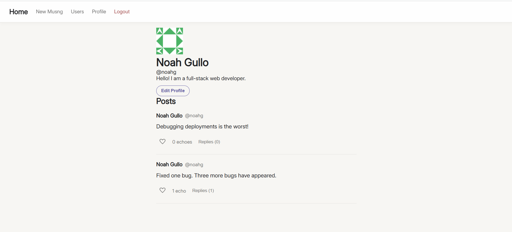
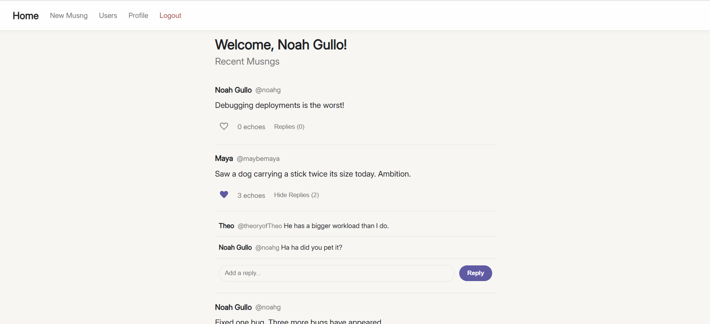
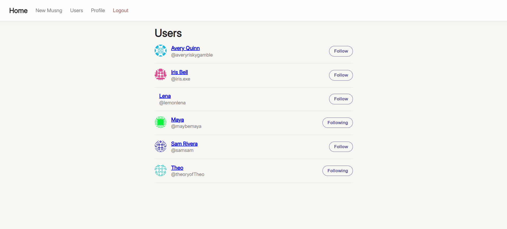

# Musng

## Live Demo

[Try the Live Demo](https://musng-production.up.railway.app/)

## Description

Musng is a full-stack social media app for sharing short, passing thoughts. Inspired by the idea of a musing, Musng lets users create posts, follow other users, echo posts they enjoy, reply to conversations, and customize their profiles. Visitors can also browse the community as guests without creating an account.

## Screenshots

### Profile

### Feed

### Users

## Core Features

- **User authentication.** Users can create an account, log in, and log out using Passport.js with persistent session-based authentication.
- **Guest browsing.** Visitors can browse the feed, users, and profiles without creating an account, while interactions remain limited to authenticated users.
- **Musng feed.** Users can create short text posts of up to 500 characters and view recent posts from themselves and users they follow.
- **Echoes and replies.** Authenticated users can echo posts they enjoy and reply to other users' musngs.
- **User following.** Users can discover other accounts, follow or unfollow them, and build a personalized feed from the people they follow.
- **Customizable profiles.** Users can set a display name, bio, and profile picture and view each user's posts from their profile.
- **User directory.** Users and guests can browse accounts and visit individual profiles.
- **Persistent data.** Accounts, profiles, posts, replies, echoes, follows, and sessions are stored in PostgreSQL and persist across sessions.

## Tech Stack

| **Area** | **Technologies** |
| --- | --- |
| **Frontend** | React, React Router, Vite, CSS |
| **Backend** | Node.js, Express, Passport.js, Express Validator |
| **Database** | PostgreSQL, Prisma ORM |
| **Deployment** | Railway |

## API

| **Method** | **Endpoint** | **Description** |
| --- | --- | --- |
| `POST` | `/api/signup` | Creates a new user account |
| `POST` | `/api/login` | Authenticates a user |
| `POST` | `/api/logout` | Logs out the authenticated user |
| `GET` | `/api/me` | Retrieves the current authenticated user, if any |
| `PUT` | `/api/me/profile` | Updates the authenticated user's profile |
| `GET` | `/api/posts` | Retrieves the current feed |
| `POST` | `/api/posts` | Creates a new musng |
| `POST` | `/api/posts/:id/like` | Echoes a musng |
| `DELETE` | `/api/posts/:id/like` | Removes an echo from a musng |
| `POST` | `/api/posts/:id/comments` | Adds a reply to a musng |
| `GET` | `/api/users` | Retrieves the user directory |
| `GET` | `/api/users/:id` | Retrieves a user's profile and posts |
| `POST` | `/api/users/:id/follow` | Follows a user |
| `DELETE` | `/api/users/:id/follow` | Unfollows a user |

## Reflection

Building Musng gave me experience developing a full-stack application from the database schema through the user interface. One of the biggest challenges was connecting authentication, sessions, and authorization across the React frontend and Express backend, especially when deploying the application and supporting both authenticated users and guests.

I also learned how quickly features in a social application become interconnected. Adding follows affected the feed and profiles, while echoes and replies required coordinating database relationships, API routes, and frontend state. Prisma helped make these relationships easier to manage, while Passport.js and persistent PostgreSQL sessions provided authentication across requests.

If I continued developing Musng, I would focus on improving the overall architecture by centralizing authentication state, adding features such as notifications and reply/echo interactions, and expanding the feed and discovery systems. I would also continue improving accessibility, responsive design, and validation throughout the application.

## Credits

- [Inter](https://fonts.google.com/specimen/Inter) font from [Google Fonts](https://fonts.google.com/).
- Profile avatars are provided by [Gravatar](https://gravatar.com/), using Gravatar's generated identicons as fallback images.